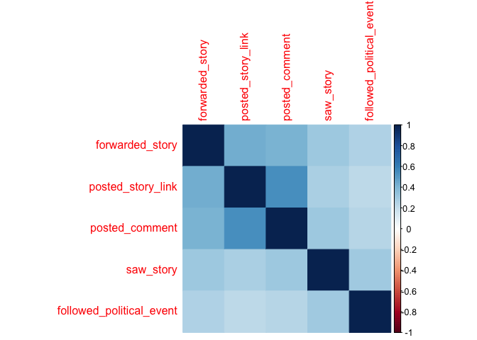

CES_analysis_Final
================
Jackson
2023-07-14

#### Load in Libraries

``` r
library(tidyverse)
library(visdat)
library(lavaan)
library(psych)
library(corrplot)
library(stargazer)
library(margins)
library(mfx)
```

#### Load in data

``` r
if (file.exists("/Users/jackson/Desktop/Thesis/Data/CES20_Common_OUTPUT_vv.csv")) { ## for me :)
  data <- read_csv("/Users/jackson/Desktop/Thesis/Data/CES20_Common_OUTPUT_vv.csv")
} else {
  data <- read_csv("https://dataverse.harvard.edu/api/access/datafile/4949558") # WARNING: 188mb download.
} 
```

    ## New names:
    ## Rows: 61000 Columns: 717
    ## ── Column specification
    ## ──────────────────────────────────────────────────────── Delimiter: "," chr
    ## (175): race_other, CC20_hisp_t, CC20_asian_t, CC20_309d_t, CC20_364a_t,... dbl
    ## (537): ...1, caseid, commonweight, commonpostweight, vvweight, vvweight... lgl
    ## (1): multrace_97 dttm (4): starttime, endtime, starttime_post, endtime_post
    ## ℹ Use `spec()` to retrieve the full column specification for this data. ℹ
    ## Specify the column types or set `show_col_types = FALSE` to quiet this message.
    ## • `` -> `...1`

### Transform data

Relevant variables subsetted from CES 2020 dataset, and re-coded/ to
mirror variable specification from Ansolabehere and Hersh 2012.

``` r
data_2 <- data %>% 
  dplyr::select(
         caseid, 
         CL_2020gvm, #did you actually vote (validated)? - yes if 1-4, no if 5
         CC20_401, #did you vote? - yes if 5, no otherwise (post)
         CC20_363, #vote intention - 1 = yes definitely, 2 = probably, 3 = I already voted, 4 = I plan to vote before Nov 3rd, 5 = no, 6 = undecided
                      # Did you...
         CC20_300_1,  # use social media in the last 24h?
         CC20_300d_1, # post story link or video about politics?
         CC20_300d_2, # post comment about politics?
         CC20_300d_3, # read a story or watched video about politics?
         CC20_300d_4, # follow a political event?
         CC20_300d_5, # forward a story video photo or link about politics to friend?
         CC20_300d_6, # none of the above
         birthyr,
         gender,
         educ,
         race,
         marstat, #marital status
         faminc_new,#family annual income over past yr
         pew_churatd, #church attendance
         newsint, #political interest
         ideo5, #ideology 1 - very liberal, 2 - liberal, 3 - moderate, 4 - conservative, 5 - very conservative, 6 - don't know
         pid7, # 7 point party ID
         commonweight,
         commonpostweight
         ) %>% 

  mutate(
    
    #Did you plan to vote? Did you vote?
    intend_to_vote = ifelse(CC20_363 %in% c(1,4), 1, 0),
    did_you_vote = ifelse(CC20_401 == 5, 1, 0),
    validated_vote = ifelse(CL_2020gvm == 5, 0, 1),
    over_reported_intention = ifelse(intend_to_vote == 1 , 1, 0),
    over_reported_vote = ifelse(did_you_vote == 1, 1, 0),
    
    #Social media usage
    posted_story_link = ifelse(CC20_300d_1 == 2, 0, 1),
    posted_comment = ifelse(CC20_300d_2 == 2, 0, 1),
    saw_story = ifelse(CC20_300d_3 == 2, 0, 1),
    followed_political_event = ifelse(CC20_300d_4 == 2, 0, 1),
    forwarded_story = ifelse(CC20_300d_5 == 2, 0, 1),
    
    # To what degree have you been politically engaged (gross)?
    social_media_engagement = posted_story_link + posted_comment + saw_story + followed_political_event + forwarded_story,
    
     # Have you been politically engaged on social media within the past day?
    is_politically_engaged = ifelse(social_media_engagement >= 1, 1, 0),
    
    #What kind of user are you?
    active_user = ifelse(posted_comment == 1 | posted_story_link == 1 | followed_political_event == 1, 1, 0),

    passive_user = ifelse((posted_comment == 0 & posted_story_link == 0 & forwarded_story == 0) &
                      (saw_story == 1 | followed_political_event == 1), 1, 0),

    
    #Education
    education = case_when(
      educ == 1 ~ 0,
      educ == 2 ~ 1,
      educ %in% c(3, 4) ~ 2,
      educ == 5 ~ 3,
      educ == 6 ~ 4
    ),
    
    #Household Income
    income = case_when(
      faminc_new %in% c(1, 2, 3) ~ 1,
      faminc_new %in% c(4, 5) ~ 2,
      faminc_new %in% c(6, 7, 8, 9) ~ 3,
      faminc_new %in% c(10, 11, 12, 13, 14, 16) ~ 4,
      faminc_new == 97 ~ 5
    ),
    
    #Church attendance
    church_attendance = case_when(
      pew_churatd == 6 ~ 0,
      pew_churatd %in% c(4, 5) ~ 1,
      pew_churatd == 3 ~ 2,
      pew_churatd %in% c(1, 2) ~ 3,
      pew_churatd == 7 ~ 4),

    #Age
    age = 2020 - birthyr,
    age_cat = cut(age,
                  
                  breaks = c(17, 24, 34, 44, 54, Inf),
                  labels = c("1", "2", "3", "4", "5"), #18-24, 25-44, 45-54, 55 and over
                  right = TRUE, include.lowest = TRUE),
    
    #Ideological strength
    ideological_strength = case_when(
      ideo5 %in% c(3, 6) ~ 0,
      ideo5 %in% c(2, 4) ~ 1,
      ideo5 %in% c(1, 5) ~ 2
      ),

    #Political interest
    political_interest = case_when(
      newsint %in% c(7, 4) ~ 0,
      newsint == 3 ~ 1,
      newsint == 2 ~ 2,
      newsint == 1 ~ 3
    ),
    
    #Partisan strength
    partisan_strength = case_when(
      pid7 %in% c(4, 8) ~ 0,
      pid7 %in% c(3, 5) ~ 1,
      pid7 %in% c(2, 6) ~ 2,
      pid7 %in% c(1, 7) ~ 3
      ),
   
    
    #Female
    female = ifelse(gender == 2, 1, 0),

    #Race
    White = ifelse(race == 1, 1, 0),
    Black = ifelse(race == 2, 1, 0),
    other_non_White = ifelse(!race %in% c(1, 2), 1, 0),
    
    #Married
    married = ifelse(marstat == 1, 1, 0),
      
    )
```

#### Visualize missing data

``` r
vis_miss(data_2, warn_large_data = F)
```

<!-- -->

``` r
  ### Subset of solely over-reporters (intention)
overreported <- data_2 %>% 
  filter(validated_vote == 0 & intend_to_vote == 1 & !is.na(CL_2020gvm))
```

#### Delete rows with NA values in key variables.

``` r
nonvoters <- data_2 %>% 
  filter(CL_2020gvm == 5  & complete.cases(CC20_300d_6, CC20_363, CC20_401))
```

#### Create user engagement categories - either active/passive

``` r
### 50th percentile engagement score

nonvoters <- nonvoters %>% 
  mutate(user_engagement_score = saw_story + 
           2*followed_political_event + 
           3*forwarded_story + 3*posted_comment + 
           4*posted_story_link,
         
         #If user is in bottom 50th percentile then passive, otherwise active
         user_engagement_category = ifelse(user_engagement_score >= quantile(user_engagement_score, 0.5, na.rm=T), 0, 1)
         )
```

#### Confirmatory Factor Analysis

``` r
cfa <- 'latent_social_media_engagement =~ posted_story_link + posted_comment + saw_story + followed_political_event + forwarded_story'
fit<- cfa(cfa, data=nonvoters)
summary(fit, fit.measures=T)
```

    ## lavaan 0.6.16 ended normally after 30 iterations
    ## 
    ##   Estimator                                         ML
    ##   Optimization method                           NLMINB
    ##   Number of model parameters                        10
    ## 
    ##   Number of observations                          4184
    ## 
    ## Model Test User Model:
    ##                                                       
    ##   Test statistic                               206.189
    ##   Degrees of freedom                                 5
    ##   P-value (Chi-square)                           0.000
    ## 
    ## Model Test Baseline Model:
    ## 
    ##   Test statistic                              3877.282
    ##   Degrees of freedom                                10
    ##   P-value                                        0.000
    ## 
    ## User Model versus Baseline Model:
    ## 
    ##   Comparative Fit Index (CFI)                    0.948
    ##   Tucker-Lewis Index (TLI)                       0.896
    ## 
    ## Loglikelihood and Information Criteria:
    ## 
    ##   Loglikelihood user model (H0)             -10968.352
    ##   Loglikelihood unrestricted model (H1)     -10865.258
    ##                                                       
    ##   Akaike (AIC)                               21956.705
    ##   Bayesian (BIC)                             22020.095
    ##   Sample-size adjusted Bayesian (SABIC)      21988.319
    ## 
    ## Root Mean Square Error of Approximation:
    ## 
    ##   RMSEA                                          0.098
    ##   90 Percent confidence interval - lower         0.087
    ##   90 Percent confidence interval - upper         0.110
    ##   P-value H_0: RMSEA <= 0.050                    0.000
    ##   P-value H_0: RMSEA >= 0.080                    0.996
    ## 
    ## Standardized Root Mean Square Residual:
    ## 
    ##   SRMR                                           0.043
    ## 
    ## Parameter Estimates:
    ## 
    ##   Standard errors                             Standard
    ##   Information                                 Expected
    ##   Information saturated (h1) model          Structured
    ## 
    ## Latent Variables:
    ##                                     Estimate  Std.Err  z-value  P(>|z|)
    ##   latent_social_media_engagement =~                                    
    ##     postd_stry_lnk                     1.000                           
    ##     posted_comment                     1.113    0.033   33.499    0.000
    ##     saw_story                          0.741    0.030   24.346    0.000
    ##     fllwd_pltcl_vn                     0.524    0.026   20.438    0.000
    ##     forwarded_stry                     0.904    0.029   31.008    0.000
    ## 
    ## Variances:
    ##                    Estimate  Std.Err  z-value  P(>|z|)
    ##    .postd_stry_lnk    0.088    0.003   29.641    0.000
    ##    .posted_comment    0.102    0.004   28.613    0.000
    ##    .saw_story         0.189    0.005   41.856    0.000
    ##    .fllwd_pltcl_vn    0.150    0.003   43.319    0.000
    ##    .forwarded_stry    0.123    0.003   36.628    0.000
    ##     ltnt_scl_md_ng    0.090    0.004   22.161    0.000

``` r
### All variables are positive indicators of social media engagement

alpha(nonvoters[, c("posted_story_link", "posted_comment", "saw_story", "followed_political_event", "forwarded_story")])
```

    ## 
    ## Reliability analysis   
    ## Call: alpha(x = nonvoters[, c("posted_story_link", "posted_comment", 
    ##     "saw_story", "followed_political_event", "forwarded_story")])
    ## 
    ##   raw_alpha std.alpha G6(smc) average_r S/N   ase mean   sd median_r
    ##       0.71      0.71    0.68      0.33 2.5 0.007 0.33 0.31     0.31
    ## 
    ##     95% confidence boundaries 
    ##          lower alpha upper
    ## Feldt      0.7  0.71  0.73
    ## Duhachek   0.7  0.71  0.73
    ## 
    ##  Reliability if an item is dropped:
    ##                          raw_alpha std.alpha G6(smc) average_r S/N alpha se
    ## posted_story_link             0.64      0.64    0.58      0.31 1.8   0.0090
    ## posted_comment                0.63      0.63    0.58      0.30 1.7   0.0092
    ## saw_story                     0.69      0.69    0.64      0.35 2.2   0.0078
    ## followed_political_event      0.71      0.71    0.66      0.38 2.5   0.0074
    ## forwarded_story               0.65      0.65    0.61      0.32 1.9   0.0088
    ##                           var.r med.r
    ## posted_story_link        0.0036  0.31
    ## posted_comment           0.0054  0.29
    ## saw_story                0.0171  0.34
    ## followed_political_event 0.0104  0.37
    ## forwarded_story          0.0139  0.29
    ## 
    ##  Item statistics 
    ##                             n raw.r std.r r.cor r.drop mean   sd
    ## posted_story_link        4184  0.72  0.73  0.65   0.53 0.23 0.42
    ## posted_comment           4184  0.74  0.74  0.67   0.55 0.31 0.46
    ## saw_story                4184  0.67  0.65  0.49   0.42 0.61 0.49
    ## followed_political_event 4184  0.58  0.60  0.41   0.36 0.23 0.42
    ## forwarded_story          4184  0.71  0.71  0.60   0.51 0.27 0.44
    ## 
    ## Non missing response frequency for each item
    ##                             0    1 miss
    ## posted_story_link        0.77 0.23    0
    ## posted_comment           0.69 0.31    0
    ## saw_story                0.39 0.61    0
    ## followed_political_event 0.77 0.23    0
    ## forwarded_story          0.73 0.27    0

``` r
### Raw alphas range from ~0.66-0.72 indicating stable internal consistency.
```

#### Descriptive Statistics Tables

``` r
categorical_vars <- list("is_politically_engaged",
                         "social_media_engagement",
                         "passive_user",
                         "user_engagement_category",
                         "ideo5",
                         "education",
                         "income",
                         "Black",
                         "other_non_White",
                         "married",
                         "church_attendance",
                         "age_cat",
                         "ideological_strength",
                         "female",
                         "political_interest")

get_stats <- function(data, var) {
  data %>%
    count(.data[[var]]) %>%
    mutate(
      proportion = n / sum(n) * 100,
      cumulative_freq = cumsum(proportion)
    )
}

stats_list <- lapply(categorical_vars, function(var) get_stats(nonvoters, var))

stats_list
```

    ## [[1]]
    ## # A tibble: 2 × 4
    ##   is_politically_engaged     n proportion cumulative_freq
    ##                    <dbl> <int>      <dbl>           <dbl>
    ## 1                      0  1243       29.7            29.7
    ## 2                      1  2941       70.3           100  
    ## 
    ## [[2]]
    ## # A tibble: 6 × 4
    ##   social_media_engagement     n proportion cumulative_freq
    ##                     <dbl> <int>      <dbl>           <dbl>
    ## 1                       0  1243      29.7             29.7
    ## 2                       1  1031      24.6             54.3
    ## 3                       2   763      18.2             72.6
    ## 4                       3   532      12.7             85.3
    ## 5                       4   352       8.41            93.7
    ## 6                       5   263       6.29           100  
    ## 
    ## [[3]]
    ## # A tibble: 2 × 4
    ##   passive_user     n proportion cumulative_freq
    ##          <dbl> <int>      <dbl>           <dbl>
    ## 1            0  3104       74.2            74.2
    ## 2            1  1080       25.8           100  
    ## 
    ## [[4]]
    ## # A tibble: 2 × 4
    ##   user_engagement_category     n proportion cumulative_freq
    ##                      <dbl> <int>      <dbl>           <dbl>
    ## 1                        0  2094       50.0            50.0
    ## 2                        1  2090       50.0           100  
    ## 
    ## [[5]]
    ## # A tibble: 6 × 4
    ##   ideo5     n proportion cumulative_freq
    ##   <dbl> <int>      <dbl>           <dbl>
    ## 1     1   615      14.7             14.7
    ## 2     2   750      17.9             32.6
    ## 3     3  1210      28.9             61.5
    ## 4     4   897      21.4             83.0
    ## 5     5   572      13.7             96.7
    ## 6     6   140       3.35           100  
    ## 
    ## [[6]]
    ## # A tibble: 5 × 4
    ##   education     n proportion cumulative_freq
    ##       <dbl> <int>      <dbl>           <dbl>
    ## 1         0    72       1.72            1.72
    ## 2         1   959      22.9            24.6 
    ## 3         2  1351      32.3            56.9 
    ## 4         3  1067      25.5            82.4 
    ## 5         4   735      17.6           100   
    ## 
    ## [[7]]
    ## # A tibble: 6 × 4
    ##   income     n proportion cumulative_freq
    ##    <dbl> <int>      <dbl>           <dbl>
    ## 1      1   726     17.4              17.4
    ## 2      2   784     18.7              36.1
    ## 3      3  1357     32.4              68.5
    ## 4      4   924     22.1              90.6
    ## 5      5   378      9.03             99.6
    ## 6     NA    15      0.359           100  
    ## 
    ## [[8]]
    ## # A tibble: 2 × 4
    ##   Black     n proportion cumulative_freq
    ##   <dbl> <int>      <dbl>           <dbl>
    ## 1     0  3829      91.5             91.5
    ## 2     1   355       8.48           100  
    ## 
    ## [[9]]
    ## # A tibble: 2 × 4
    ##   other_non_White     n proportion cumulative_freq
    ##             <dbl> <int>      <dbl>           <dbl>
    ## 1               0  3828      91.5             91.5
    ## 2               1   356       8.51           100  
    ## 
    ## [[10]]
    ## # A tibble: 2 × 4
    ##   married     n proportion cumulative_freq
    ##     <dbl> <int>      <dbl>           <dbl>
    ## 1       0  1893       45.2            45.2
    ## 2       1  2291       54.8           100  
    ## 
    ## [[11]]
    ## # A tibble: 5 × 4
    ##   church_attendance     n proportion cumulative_freq
    ##               <dbl> <int>      <dbl>           <dbl>
    ## 1                 0  1290      30.8             30.8
    ## 2                 1  1538      36.8             67.6
    ## 3                 2   270       6.45            74.0
    ## 4                 3  1038      24.8             98.9
    ## 5                 4    48       1.15           100  
    ## 
    ## [[12]]
    ## # A tibble: 5 × 4
    ##   age_cat     n proportion cumulative_freq
    ##   <fct>   <int>      <dbl>           <dbl>
    ## 1 1         173       4.13            4.13
    ## 2 2         575      13.7            17.9 
    ## 3 3         743      17.8            35.6 
    ## 4 4         693      16.6            52.2 
    ## 5 5        2000      47.8           100   
    ## 
    ## [[13]]
    ## # A tibble: 3 × 4
    ##   ideological_strength     n proportion cumulative_freq
    ##                  <dbl> <int>      <dbl>           <dbl>
    ## 1                    0  1350       32.3            32.3
    ## 2                    1  1647       39.4            71.6
    ## 3                    2  1187       28.4           100  
    ## 
    ## [[14]]
    ## # A tibble: 2 × 4
    ##   female     n proportion cumulative_freq
    ##    <dbl> <int>      <dbl>           <dbl>
    ## 1      0  1703       40.7            40.7
    ## 2      1  2481       59.3           100  
    ## 
    ## [[15]]
    ## # A tibble: 5 × 4
    ##   political_interest     n proportion cumulative_freq
    ##                <dbl> <int>      <dbl>           <dbl>
    ## 1                  0   188     4.49              4.49
    ## 2                  1   324     7.74             12.2 
    ## 3                  2  1032    24.7              36.9 
    ## 4                  3  2638    63.0             100.  
    ## 5                 NA     2     0.0478          100

#### Proportion of over-reporters by category

``` r
summarize_overreporters <- function(nonvoters, category) {
  nonvoters %>%
    group_by({{ category }}) %>% 
    summarize(count = n(),
              overreport = sum(over_reported_intention, na.rm = TRUE),
              prop = overreport / count)
}

prop_overreporters <- lapply(categorical_vars, function(cat) {
  summarize_overreporters(nonvoters, !!sym(cat))
})

prop_overreporters
```

    ## [[1]]
    ## # A tibble: 2 × 4
    ##   is_politically_engaged count overreport  prop
    ##                    <dbl> <int>      <dbl> <dbl>
    ## 1                      0  1243       1068 0.859
    ## 2                      1  2941       2478 0.843
    ## 
    ## [[2]]
    ## # A tibble: 6 × 4
    ##   social_media_engagement count overreport  prop
    ##                     <dbl> <int>      <dbl> <dbl>
    ## 1                       0  1243       1068 0.859
    ## 2                       1  1031        872 0.846
    ## 3                       2   763        657 0.861
    ## 4                       3   532        433 0.814
    ## 5                       4   352        293 0.832
    ## 6                       5   263        223 0.848
    ## 
    ## [[3]]
    ## # A tibble: 2 × 4
    ##   passive_user count overreport  prop
    ##          <dbl> <int>      <dbl> <dbl>
    ## 1            0  3104       2628 0.847
    ## 2            1  1080        918 0.85 
    ## 
    ## [[4]]
    ## # A tibble: 2 × 4
    ##   user_engagement_category count overreport  prop
    ##                      <dbl> <int>      <dbl> <dbl>
    ## 1                        0  2094       1758 0.840
    ## 2                        1  2090       1788 0.856
    ## 
    ## [[5]]
    ## # A tibble: 6 × 4
    ##   ideo5 count overreport  prop
    ##   <dbl> <int>      <dbl> <dbl>
    ## 1     1   615        486 0.790
    ## 2     2   750        583 0.777
    ## 3     3  1210       1010 0.835
    ## 4     4   897        829 0.924
    ## 5     5   572        529 0.925
    ## 6     6   140        109 0.779
    ## 
    ## [[6]]
    ## # A tibble: 5 × 4
    ##   education count overreport  prop
    ##       <dbl> <int>      <dbl> <dbl>
    ## 1         0    72         60 0.833
    ## 2         1   959        824 0.859
    ## 3         2  1351       1156 0.856
    ## 4         3  1067        903 0.846
    ## 5         4   735        603 0.820
    ## 
    ## [[7]]
    ## # A tibble: 6 × 4
    ##   income count overreport  prop
    ##    <dbl> <int>      <dbl> <dbl>
    ## 1      1   726        601 0.828
    ## 2      2   784        649 0.828
    ## 3      3  1357       1165 0.859
    ## 4      4   924        785 0.850
    ## 5      5   378        332 0.878
    ## 6     NA    15         14 0.933
    ## 
    ## [[8]]
    ## # A tibble: 2 × 4
    ##   Black count overreport  prop
    ##   <dbl> <int>      <dbl> <dbl>
    ## 1     0  3829       3255 0.850
    ## 2     1   355        291 0.820
    ## 
    ## [[9]]
    ## # A tibble: 2 × 4
    ##   other_non_White count overreport  prop
    ##             <dbl> <int>      <dbl> <dbl>
    ## 1               0  3828       3247 0.848
    ## 2               1   356        299 0.840
    ## 
    ## [[10]]
    ## # A tibble: 2 × 4
    ##   married count overreport  prop
    ##     <dbl> <int>      <dbl> <dbl>
    ## 1       0  1893       1557 0.823
    ## 2       1  2291       1989 0.868
    ## 
    ## [[11]]
    ## # A tibble: 5 × 4
    ##   church_attendance count overreport  prop
    ##               <dbl> <int>      <dbl> <dbl>
    ## 1                 0  1290       1040 0.806
    ## 2                 1  1538       1323 0.860
    ## 3                 2   270        226 0.837
    ## 4                 3  1038        918 0.884
    ## 5                 4    48         39 0.812
    ## 
    ## [[12]]
    ## # A tibble: 5 × 4
    ##   age_cat count overreport  prop
    ##   <fct>   <int>      <dbl> <dbl>
    ## 1 1         173        130 0.751
    ## 2 2         575        467 0.812
    ## 3 3         743        643 0.865
    ## 4 4         693        611 0.882
    ## 5 5        2000       1695 0.848
    ## 
    ## [[13]]
    ## # A tibble: 3 × 4
    ##   ideological_strength count overreport  prop
    ##                  <dbl> <int>      <dbl> <dbl>
    ## 1                    0  1350       1119 0.829
    ## 2                    1  1647       1412 0.857
    ## 3                    2  1187       1015 0.855
    ## 
    ## [[14]]
    ## # A tibble: 2 × 4
    ##   female count overreport  prop
    ##    <dbl> <int>      <dbl> <dbl>
    ## 1      0  1703       1446 0.849
    ## 2      1  2481       2100 0.846
    ## 
    ## [[15]]
    ## # A tibble: 5 × 4
    ##   political_interest count overreport  prop
    ##                <dbl> <int>      <dbl> <dbl>
    ## 1                  0   188        142 0.755
    ## 2                  1   324        262 0.809
    ## 3                  2  1032        879 0.852
    ## 4                  3  2638       2262 0.857
    ## 5                 NA     2          1 0.5

#### Proportion of over-reporters by social media engagement figure

``` r
generate_proportions_fig <- function(data, group_col, x_label, title) {
  data %>% 
    group_by(!!sym(group_col), over_reported_intention) %>%
    summarize(count = n(), .groups = "drop") %>%
    mutate(over_reported_intention = ifelse(over_reported_intention == 1, "Yes", "No")) %>%
    mutate(over_reported_intention = factor(over_reported_intention, levels = c("No", "Yes"))) %>%
    group_by(!!sym(group_col)) %>%
    mutate(proportion = count / sum(count)) %>%
    ungroup() %>%
    
    ggplot(aes(x = !!sym(group_col), y = proportion, fill = over_reported_intention)) +
    geom_bar(stat = "identity", position = "stack") +
    scale_fill_grey(name = "Over-reported vote") +
    xlab(x_label) +
    ylab("Proportion") +
    theme_minimal() +
    ggtitle(title)
}

is_politically_engaged_proportions <- generate_proportions_fig(nonvoters, 
                                     "is_politically_engaged", 
                                     "Is politically engaged?", 
                                     "Proportion of Over-report by Political Engagement on Social Media")
is_politically_engaged_proportions
```

<!-- -->

``` r
user_engagement_proportions <- generate_proportions_fig(nonvoters, 
                                  "user_engagement_category", 
                                  "User Engagement Category", 
                                  "Proportion of Over-report by User Engagement")
user_engagement_proportions
```

<!-- -->

``` r
sme_proportions <- generate_proportions_fig(nonvoters, 
                  "social_media_engagement", 
                  "Social Media Engagement", 
                  "Proportion of Over-report by Social Media Engagement")
sme_proportions
```

<!-- -->

``` r
ideo_proportions <- generate_proportions_fig(nonvoters, 
                   "ideo5", 
                   "Ideology", 
                   "Proportion of Over-report by Ideology")
ideo_proportions
```

<!-- -->

``` r
over_report_ideo <- nonvoters %>%
  
  mutate(over_reported_intention = factor(over_reported_intention, levels = c(0, 1), labels = c("No", "Yes"))) %>%
  
  mutate(ideo_label = case_when(
    ideo5 == 1 ~ "Very Liberal",
    ideo5 == 2 ~ "Liberal",
    ideo5 == 3 ~ "Moderate",
    ideo5 == 4 ~ "Conservative",
    ideo5 == 5 ~ "Very Conservative",
    ideo5 == 6 ~ "Don't know"
  ))%>% 
  mutate(ideo_label = factor(ideo_label, levels = c("Very Liberal", "Liberal", "Moderate", "Conservative", "Very Conservative", "Don't know"))) %>%
  
  ggplot(aes(x = ideo_label, fill = over_reported_intention)) +
  geom_bar(position = "stack") +
  labs(x = "Ideology", y = "Count", fill = "Over Reported Vote") +
  theme(axis.text.x = element_text(angle = 45, hjust = 1)) +
  ggtitle("Proportion of over-reports among nonvoters by ideology")
over_report_ideo
```

<!-- -->

``` r
over_report_engaged <- nonvoters %>% 
  mutate(over_reported_intention = factor(over_reported_intention, levels = c(0, 1), labels = c("No", "Yes"))) %>%
  mutate(engaged_label = case_when(
    is_politically_engaged == 1 ~ "Yes",
    is_politically_engaged == 0 ~ "No"
  )) %>% 
  mutate(engaged_lable = factor(engaged_label, levels = c("No", "Yes"))) %>%
  
  ggplot(aes(engaged_label, fill=over_reported_intention)) +
  geom_bar(position = "stack") +
  labs(x="is engaged?", y="Count", fill="Over reported vote") +
  theme(axis.text.x = element_text(angle = 45, hjust = 1)) +
  ggtitle("Proportion of over-reports among nonvoters - no social media vs. social media")
over_report_engaged
```

<!-- -->

``` r
# Higher proportions of conservatives and very conservatives over-reported in the data, compared to
# very liberals, liberals, and moderates, but conservative groups also have less total over reporters
```

#### Correlation matrices

``` r
matrix_independent_vars <- nonvoters %>% 
  dplyr::select(social_media_engagement, 
                 ideo5,
                 education,
                 age,
                 income,
                 White,
                 church_attendance,
                 ideological_strength,
                 political_interest,
                 partisan_strength,
                 married
                 )


matrix <- cor(na.omit(matrix_independent_vars), use = "complete.obs")
corrplot(matrix, method = "color", order = "hclust")
```

<!-- -->

``` r
matrix_social_media <- nonvoters %>% 
  dplyr::select(posted_story_link,
         posted_comment,
         saw_story,
         followed_political_event,
         forwarded_story)

matrix_2 <- cor(na.omit(matrix_social_media), use = "complete.obs")
matrix_2
```

    ##                          posted_story_link posted_comment saw_story
    ## posted_story_link                1.0000000      0.5462711 0.2741905
    ## posted_comment                   0.5462711      1.0000000 0.3165214
    ## saw_story                        0.2741905      0.3165214 1.0000000
    ## followed_political_event         0.2202531      0.2414477 0.3048678
    ## forwarded_story                  0.4367845      0.4167966 0.3127143
    ##                          followed_political_event forwarded_story
    ## posted_story_link                       0.2202531       0.4367845
    ## posted_comment                          0.2414477       0.4167966
    ## saw_story                               0.3048678       0.3127143
    ## followed_political_event                1.0000000       0.2678741
    ## forwarded_story                         0.2678741       1.0000000

``` r
corrplot(matrix_2, method="color", order="hclust")
```

<!-- -->

``` r
### Positive correlations - Education and Income, Partisan and Ideological strength, Political interest and SME, Married and Income
### Negative correlations - Church attendance and Partisan strength, Education and age
```

#### Modelling

``` r
#Convert variables to factors
nonvoters <- nonvoters %>%
  mutate_at(vars(over_reported_intention,
                 active_user,
                 passive_user,
                 posted_story_link,
                 posted_comment,
                 saw_story,
                 followed_political_event,
                 forwarded_story,
                 age_cat,
                 White,
                 Black,
                 other_non_White,
                 female,
                 married,
                 ), as.factor)
```

``` r
### Create sub-groups

nonvoters_engaged <- nonvoters %>% 
  filter(user_engagement_score != 0)

nonvoters_disengaged <- nonvoters %>% 
  filter(user_engagement_score == 0)

nonvoters_cts <- nonvoters %>% 
  filter(
         ideo5 != 6, 
         faminc_new != 17, 
         church_attendance != 7
         )

nonvoters_cts_engaged <- nonvoters %>% 
  filter(
         user_engagement_score != 0,
         ideo5 != 6, 
         faminc_new != 17, 
         church_attendance != 7
         )
```

#### Hypothesis 1: Political activity on social media is positively associated with over-reporting vote intentions when compared to those who are not active

``` r
### Politically engaged on social media over past 24 hours
  
model_1 <- glm(over_reported_intention ~ as.factor(is_politically_engaged) +
                 as.factor(education) + 
                 as.factor(income) +
                 Black +
                 other_non_White + 
                 married + 
                 as.factor(church_attendance) +
                 as.factor(age_cat) +
                 as.factor(ideological_strength) + 
                 female + 
                 as.factor(political_interest) 
                 ,
                 data = nonvoters, family = binomial
               )

model_1a <- glm(over_reported_intention ~ as.factor(is_politically_engaged) ,
                 data = nonvoters, family = binomial
                )

model_1_cts<- lm(as.numeric(over_reported_intention) ~ as.factor(is_politically_engaged) 
                        +
                          education +
                 faminc_new +
                 Black +
                 other_non_White +
                 married +
                 church_attendance +
                 age_cat +
                 ideological_strength +
                 female +
                 political_interest 
                 ,
                 data = nonvoters_cts, weights = commonweight
                 )


stargazer(model_1, model_1a, model_1_cts, type="text")
stargazer(model_1_cts, type="text")
```

#### Hypothesis 2: Passive social media users are more likely to over-report their voting intentions than their more active counterparts

``` r
model_2 <- glm(over_reported_intention ~ as.factor(social_media_engagement) + 
                 education + 
                 income +
                 Black +
                 other_non_White + 
                 married + 
                 church_attendance +
                 age_cat +
                 ideological_strength + 
                 female + 
                 political_interest 
               ,  
               data = nonvoters_engaged, family = binomial
               ) 


model_2a <- glm(over_reported_intention ~ as.factor(social_media_engagement),
               data = nonvoters_engaged, family = binomial
               ) 

model_2_cts <- lm(as.numeric(over_reported_intention) ~ social_media_engagement + 
                 education +
                 faminc_new +
                 Black +
                 other_non_White +
                 married +
                 church_attendance +
                 age_cat +
                 ideological_strength +
                 female +
                 political_interest 
               ,  
               data = nonvoters_cts_engaged, weights = commonweight
               ) 

stargazer(model_2, model_2a, model_2_cts, type="text")
```

#### Robustness check for individual actions on social media

``` r
model_3 <- glm(over_reported_intention ~ as.factor(saw_story) + as.factor(followed_political_event) + as.factor(posted_story_link) + as.factor(posted_comment) + as.factor(forwarded_story) +
                 education + 
                 income +
                 Black +
                 other_non_White + 
                 married + 
                 church_attendance +
                 age_cat +
                 ideological_strength + 
                 female + 
                 political_interest 
               ,  
               data = nonvoters, family = binomial
               ) 

model_3a <- glm(over_reported_intention ~ as.factor(saw_story) + as.factor(followed_political_event) + 
                  as.factor(posted_story_link) + as.factor(posted_comment) + as.factor(forwarded_story)
               ,  
               data = nonvoters, family = binomial
               ) 

model_3_cts <- lm(as.numeric(over_reported_intention) ~ 
                 as.factor(saw_story) + as.factor(followed_political_event) + 
                 as.factor(posted_story_link) + as.factor(posted_comment) + as.factor(forwarded_story) +
                 education +
                 faminc_new +
                 Black +
                 other_non_White +
                 married +
                 church_attendance +
                 age_cat +
                 ideological_strength +
                 female +
                 political_interest,
               data = nonvoters_cts, weights = commonweight
             ) 

stargazer(model_3, model_3a, model_3_cts, type="text")
```

``` r
model_4 <- glm(over_reported_intention ~ as.factor(passive_user) + 
                 as.factor(education) + 
                 as.factor(income) +
                 Black +
                 other_non_White + 
                 married + 
                 as.factor(church_attendance) +
                 as.factor(age_cat) +
                 as.factor(ideological_strength) + 
                 female + 
                 as.factor(political_interest)
               ,  
               data = nonvoters_engaged, family = binomial
              
               )


model_4a <- glm(over_reported_intention ~ as.factor(passive_user), 
                data = nonvoters_engaged, family=binomial
                )

model_4_cts <- lm(as.numeric(over_reported_intention) ~ as.factor(passive_user) + 
                 education +
                 faminc_new +
                 Black +
                 other_non_White +
                 married +
                 church_attendance +
                 age_cat +
                 female +
                 ideological_strength +
                 political_interest 
               ,  
               data = nonvoters_cts_engaged, weights = commonweight
               )

stargazer(model_4, model_4a, model_4_cts, type="text")
```

``` r
model_4_robust <- glm(over_reported_intention ~ as.factor(user_engagement_category) + 
                      education + 
                      income +
                      Black +
                      other_non_White + 
                      married + 
                      church_attendance +
                      age_cat +
                      ideological_strength + 
                      female + 
                      political_interest 
                      ,
                     data = nonvoters_engaged, family = binomial
                
                     )

model_4a_robust <- glm(over_reported_intention ~ as.factor(user_engagement_category) 
                 ,
                 data = nonvoters_engaged, family = binomial
                
                )

model_4_robust_cts <- lm(as.numeric(over_reported_intention) ~ as.factor(user_engagement_category) +
                         education + 
                         faminc_new +
                         Black +
                         other_non_White + 
                         married + 
                         church_attendance +
                         age_cat +
                         ideological_strength + 
                         female + 
                         political_interest 
                         ,
                         data = nonvoters_cts_engaged
                         , weights=commonweight
                         )

stargazer(model_4_robust, model_4a_robust, model_4_robust_cts, type="text")
```

#### Hypothesis 3: Due to the vastness in political opinions between liberals and conservatives in 2020, there will be significant variance in over-reporting behavior between political ideology affiliations

``` r
model_5 <- glm(over_reported_intention ~ as.factor(social_media_engagement) * as.factor(ideo5) + 
                 education + 
                 income +
                 Black +
                 other_non_White + 
                 married + 
                 church_attendance +
                 age_cat +
                 #ideological_strength + ### commented out due to collinearity with ideo5
                 female + 
                 political_interest
                 ,
                 data = nonvoters_engaged, family = binomial
               )

model_5a <- glm(over_reported_intention ~ as.factor(social_media_engagement) * as.factor(ideo5) 
               ,  
                 data = nonvoters, family = binomial
               )

model_5_cts <- lm(as.numeric(over_reported_intention) ~ social_media_engagement * ideo5 +
                 education +
                 faminc_new + 
                 Black + 
                 other_non_White +
                 married +
                 church_attendance +
                 age_cat +
                 ideological_strength +
                 female +
                 political_interest
                 ,  
                 data = nonvoters_cts_engaged, weights = commonweight
                 )

stargazer(model_5, model_5a, model_5_cts, type="text")
```

#### Output

``` r
models <- list(model_1, model_2, model_4, model_4_robust, model_5)
models_cts <- list(model_1_cts, model_2_cts, model_4_cts, model_4_robust_cts, model_5_cts)
models_no_covariates <- list(model_1a, model_2a, model_3a, model_4a, model_4a_robust, model_5a)

stargazer(models, type="text")
```

    ## 
    ## ============================================================================================================
    ##                                                                        Dependent variable:                  
    ##                                                       ------------------------------------------------------
    ##                                                                      over_reported_intention                
    ##                                                          (1)        (2)        (3)        (4)        (5)    
    ## ------------------------------------------------------------------------------------------------------------
    ## as.factor(is_politically_engaged)1                     -0.253**                                             
    ##                                                        (0.107)                                              
    ##                                                                                                             
    ## as.factor(passive_user)1                                                      0.108                         
    ##                                                                              (0.109)                        
    ##                                                                                                             
    ## as.factor(education)1                                   0.130                 0.013                         
    ##                                                        (0.336)               (0.465)                        
    ##                                                                                                             
    ## as.factor(education)2                                   0.054                 -0.069                        
    ##                                                        (0.335)               (0.457)                        
    ##                                                                                                             
    ## as.factor(education)3                                   -0.125                -0.321                        
    ##                                                        (0.340)               (0.461)                        
    ##                                                                                                             
    ## as.factor(education)4                                   -0.400                -0.566                        
    ##                                                        (0.346)               (0.465)                        
    ##                                                                                                             
    ## as.factor(income)2                                      -0.085                -0.068                        
    ##                                                        (0.142)               (0.177)                        
    ##                                                                                                             
    ## as.factor(income)3                                      0.132                 0.137                         
    ##                                                        (0.139)               (0.171)                        
    ##                                                                                                             
    ## as.factor(income)4                                      0.101                 0.020                         
    ##                                                        (0.161)               (0.191)                        
    ##                                                                                                             
    ## as.factor(income)5                                      0.367*                0.337                         
    ##                                                        (0.195)               (0.230)                        
    ##                                                                                                             
    ## as.factor(social_media_engagement)2                                0.131                            0.223   
    ##                                                                   (0.139)                          (0.306)  
    ##                                                                                                             
    ## as.factor(social_media_engagement)3                                -0.234                           0.167   
    ##                                                                   (0.146)                          (0.325)  
    ##                                                                                                             
    ## as.factor(social_media_engagement)4                                -0.153                           -0.102  
    ##                                                                   (0.173)                          (0.330)  
    ##                                                                                                             
    ## as.factor(social_media_engagement)5                                -0.125                           -0.358  
    ##                                                                   (0.199)                          (0.379)  
    ##                                                                                                             
    ## as.factor(user_engagement_category)1                                                     0.105              
    ##                                                                                         (0.117)             
    ##                                                                                                             
    ## as.factor(ideo5)2                                                                                   0.015   
    ##                                                                                                    (0.269)  
    ##                                                                                                             
    ## as.factor(ideo5)3                                                                                   0.478*  
    ##                                                                                                    (0.266)  
    ##                                                                                                             
    ## as.factor(ideo5)4                                                                                  1.147*** 
    ##                                                                                                    (0.325)  
    ##                                                                                                             
    ## as.factor(ideo5)5                                                                                  1.259*** 
    ##                                                                                                    (0.415)  
    ##                                                                                                             
    ## as.factor(ideo5)6                                                                                   -0.240  
    ##                                                                                                    (0.467)  
    ##                                                                                                             
    ## education                                                        -0.205***             -0.206***   -0.120** 
    ##                                                                   (0.054)               (0.053)    (0.056)  
    ##                                                                                                             
    ## income                                                             0.061                 0.063      0.052   
    ##                                                                   (0.048)               (0.048)    (0.049)  
    ##                                                                                                             
    ## Black1                                                  -0.192   -0.482***  -0.480***  -0.468***    -0.249  
    ##                                                        (0.155)    (0.178)    (0.180)    (0.178)    (0.183)  
    ##                                                                                                             
    ## other_non_White1                                        0.020      0.053      0.039      0.046      0.038   
    ##                                                        (0.157)    (0.182)    (0.182)    (0.182)    (0.185)  
    ##                                                                                                             
    ## married1                                                0.169*     0.088      0.121      0.097      0.059   
    ##                                                        (0.101)    (0.116)    (0.120)    (0.115)    (0.117)  
    ##                                                                                                             
    ## as.factor(church_attendance)1                          0.404***              0.272**                        
    ##                                                        (0.105)               (0.124)                        
    ##                                                                                                             
    ## as.factor(church_attendance)2                           0.203                 0.191                         
    ##                                                        (0.183)               (0.217)                        
    ##                                                                                                             
    ## as.factor(church_attendance)3                          0.603***              0.494***                       
    ##                                                        (0.125)               (0.147)                        
    ##                                                                                                             
    ## as.factor(church_attendance)4                           0.186                 0.056                         
    ##                                                        (0.390)               (0.480)                        
    ##                                                                                                             
    ## as.factor(age_cat)2                                    0.453**               0.616**                        
    ##                                                        (0.214)               (0.245)                        
    ##                                                                                                             
    ## as.factor(age_cat)3                                    0.744***              0.878***                       
    ##                                                        (0.218)               (0.250)                        
    ##                                                                                                             
    ## as.factor(age_cat)4                                    0.811***              1.058***                       
    ##                                                        (0.224)               (0.260)                        
    ##                                                                                                             
    ## as.factor(age_cat)5                                     0.392*               0.503**                        
    ##                                                        (0.204)               (0.233)                        
    ##                                                                                                             
    ## as.factor(ideological_strength)1                       0.207**                0.099                         
    ##                                                        (0.105)               (0.127)                        
    ##                                                                                                             
    ## as.factor(ideological_strength)2                        0.193*                0.083                         
    ##                                                        (0.116)               (0.138)                        
    ##                                                                                                             
    ## church_attendance                                                 0.142***              0.141***    0.003   
    ##                                                                   (0.047)               (0.047)    (0.050)  
    ##                                                                                                             
    ## age_cat2                                                          0.614**               0.587**    0.509**  
    ##                                                                   (0.243)               (0.243)    (0.247)  
    ##                                                                                                             
    ## age_cat3                                                          0.875***              0.845***   0.755*** 
    ##                                                                   (0.248)               (0.248)    (0.251)  
    ##                                                                                                             
    ## age_cat4                                                          1.067***              1.036***   0.825*** 
    ##                                                                   (0.258)               (0.257)    (0.263)  
    ##                                                                                                             
    ## age_cat5                                                          0.518**               0.487**     0.240   
    ##                                                                   (0.229)               (0.228)    (0.234)  
    ##                                                                                                             
    ## ideological_strength                                               0.044                 0.038              
    ##                                                                   (0.069)               (0.068)             
    ##                                                                                                             
    ## female1                                                 0.069      0.062      0.043      0.052      0.156   
    ##                                                        (0.093)    (0.106)    (0.107)    (0.106)    (0.108)  
    ##                                                                                                             
    ## as.factor(political_interest)1                          0.423*                0.090                         
    ##                                                        (0.227)               (0.417)                        
    ##                                                                                                             
    ## as.factor(political_interest)2                         0.734***               0.328                         
    ##                                                        (0.203)               (0.373)                        
    ##                                                                                                             
    ## as.factor(political_interest)3                         0.864***               0.450                         
    ##                                                        (0.205)               (0.367)                        
    ##                                                                                                             
    ## political_interest                                                0.170**                0.156*    0.203**  
    ##                                                                   (0.083)               (0.082)    (0.086)  
    ##                                                                                                             
    ## as.factor(social_media_engagement)2:as.factor(ideo5)2                                               -0.029  
    ##                                                                                                    (0.409)  
    ##                                                                                                             
    ## as.factor(social_media_engagement)3:as.factor(ideo5)2                                               -0.573  
    ##                                                                                                    (0.420)  
    ##                                                                                                             
    ## as.factor(social_media_engagement)4:as.factor(ideo5)2                                               -0.276  
    ##                                                                                                    (0.477)  
    ##                                                                                                             
    ## as.factor(social_media_engagement)5:as.factor(ideo5)2                                               0.167   
    ##                                                                                                    (0.535)  
    ##                                                                                                             
    ## as.factor(social_media_engagement)2:as.factor(ideo5)3                                               -0.196  
    ##                                                                                                    (0.399)  
    ##                                                                                                             
    ## as.factor(social_media_engagement)3:as.factor(ideo5)3                                               -0.623  
    ##                                                                                                    (0.423)  
    ##                                                                                                             
    ## as.factor(social_media_engagement)4:as.factor(ideo5)3                                               -0.067  
    ##                                                                                                    (0.472)  
    ##                                                                                                             
    ## as.factor(social_media_engagement)5:as.factor(ideo5)3                                               0.377   
    ##                                                                                                    (0.605)  
    ##                                                                                                             
    ## as.factor(social_media_engagement)2:as.factor(ideo5)4                                               0.016   
    ##                                                                                                    (0.500)  
    ##                                                                                                             
    ## as.factor(social_media_engagement)3:as.factor(ideo5)4                                               0.012   
    ##                                                                                                    (0.563)  
    ##                                                                                                             
    ## as.factor(social_media_engagement)4:as.factor(ideo5)4                                               0.363   
    ##                                                                                                    (0.660)  
    ##                                                                                                             
    ## as.factor(social_media_engagement)5:as.factor(ideo5)4                                               0.421   
    ##                                                                                                    (0.687)  
    ##                                                                                                             
    ## as.factor(social_media_engagement)2:as.factor(ideo5)5                                               -0.581  
    ##                                                                                                    (0.582)  
    ##                                                                                                             
    ## as.factor(social_media_engagement)3:as.factor(ideo5)5                                               -0.597  
    ##                                                                                                    (0.623)  
    ##                                                                                                             
    ## as.factor(social_media_engagement)4:as.factor(ideo5)5                                               -0.045  
    ##                                                                                                    (0.669)  
    ##                                                                                                             
    ## as.factor(social_media_engagement)5:as.factor(ideo5)5                                               0.598   
    ##                                                                                                    (0.786)  
    ##                                                                                                             
    ## as.factor(social_media_engagement)2:as.factor(ideo5)6                                               0.590   
    ##                                                                                                    (0.921)  
    ##                                                                                                             
    ## as.factor(social_media_engagement)3:as.factor(ideo5)6                                               0.313   
    ##                                                                                                    (0.948)  
    ##                                                                                                             
    ## as.factor(social_media_engagement)4:as.factor(ideo5)6                                               12.686  
    ##                                                                                                   (265.414) 
    ##                                                                                                             
    ## as.factor(social_media_engagement)5:as.factor(ideo5)6                                               0.587   
    ##                                                                                                    (1.291)  
    ##                                                                                                             
    ## Constant                                                0.087     0.707**     0.438     0.705**     0.342   
    ##                                                        (0.420)    (0.328)    (0.616)    (0.331)    (0.387)  
    ##                                                                                                             
    ## ------------------------------------------------------------------------------------------------------------
    ## Observations                                            4,167      2,925      2,925      2,925      2,925   
    ## Log Likelihood                                        -1,727.327 -1,241.834 -1,240.689 -1,244.620 -1,201.195
    ## Akaike Inf. Crit.                                     3,508.654  2,519.668  2,535.378  2,519.241  2,486.390 
    ## ============================================================================================================
    ## Note:                                                                            *p<0.1; **p<0.05; ***p<0.01

``` r
stargazer(models_cts, type="text")
```

    ## 
    ## =================================================================================================================================================================
    ##                                                                                          Dependent variable:                                                     
    ##                                      ----------------------------------------------------------------------------------------------------------------------------
    ##                                                                                  as.numeric(over_reported_intention)                                             
    ##                                                (1)                      (2)                      (3)                      (4)                      (5)           
    ## -----------------------------------------------------------------------------------------------------------------------------------------------------------------
    ## as.factor(is_politically_engaged)1           -0.022*                                                                                                             
    ##                                              (0.012)                                                                                                             
    ##                                                                                                                                                                  
    ## social_media_engagement                                                -0.008                                                                    -0.021*         
    ##                                                                       (0.005)                                                                    (0.012)         
    ##                                                                                                                                                                  
    ## as.factor(passive_user)1                                                                        0.012                                                            
    ##                                                                                                (0.013)                                                           
    ##                                                                                                                                                                  
    ## as.factor(user_engagement_category)1                                                                                     0.006                                   
    ##                                                                                                                         (0.014)                                  
    ##                                                                                                                                                                  
    ## ideo5                                                                                                                                            0.032***        
    ##                                                                                                                                                  (0.010)         
    ##                                                                                                                                                                  
    ## education                                   -0.016***                -0.023***                -0.023***                -0.023***                 -0.013**        
    ##                                              (0.005)                  (0.006)                  (0.006)                  (0.006)                  (0.006)         
    ##                                                                                                                                                                  
    ## faminc_new                                   0.0004**                 0.0004*                  0.0004*                  0.0004*                  0.0004*         
    ##                                              (0.0002)                 (0.0002)                 (0.0002)                 (0.0002)                 (0.0002)        
    ##                                                                                                                                                                  
    ## Black1                                        -0.031                 -0.066***                -0.065***                -0.065***                  -0.035         
    ##                                              (0.019)                  (0.023)                  (0.023)                  (0.023)                  (0.024)         
    ##                                                                                                                                                                  
    ## other_non_White1                              -0.018                   -0.006                   -0.008                   -0.008                  -0.0003         
    ##                                              (0.021)                  (0.025)                  (0.025)                  (0.025)                  (0.024)         
    ##                                                                                                                                                                  
    ## married1                                      0.018                    0.014                    0.015                    0.015                    0.006          
    ##                                              (0.011)                  (0.014)                  (0.014)                  (0.014)                  (0.013)         
    ##                                                                                                                                                                  
    ## church_attendance                            0.021***                 0.019***                 0.019***                 0.019***                  0.002          
    ##                                              (0.004)                  (0.005)                  (0.005)                  (0.005)                  (0.006)         
    ##                                                                                                                                                                  
    ## age_cat2                                     0.070**                  0.101***                 0.100***                 0.100***                 0.084**         
    ##                                              (0.033)                  (0.038)                  (0.038)                  (0.038)                  (0.038)         
    ##                                                                                                                                                                  
    ## age_cat3                                     0.107***                 0.136***                 0.135***                 0.135***                 0.114***        
    ##                                              (0.033)                  (0.038)                  (0.038)                  (0.038)                  (0.038)         
    ##                                                                                                                                                                  
    ## age_cat4                                     0.115***                 0.179***                 0.177***                 0.176***                 0.140***        
    ##                                              (0.032)                  (0.038)                  (0.038)                  (0.038)                  (0.038)         
    ##                                                                                                                                                                  
    ## age_cat5                                     0.074**                  0.102***                 0.101***                 0.100***                  0.063*         
    ##                                              (0.031)                  (0.036)                  (0.036)                  (0.036)                  (0.036)         
    ##                                                                                                                                                                  
    ## ideological_strength                          0.005                    -0.001                   -0.002                   -0.002                   -0.006         
    ##                                              (0.007)                  (0.008)                  (0.008)                  (0.008)                  (0.008)         
    ##                                                                                                                                                                  
    ## female1                                       0.002                    0.003                    0.003                    0.003                    0.010          
    ##                                              (0.011)                  (0.013)                  (0.013)                  (0.013)                  (0.013)         
    ##                                                                                                                                                                  
    ## political_interest                           0.018**                   0.008                    0.006                    0.005                    0.012          
    ##                                              (0.008)                  (0.011)                  (0.011)                  (0.011)                  (0.011)         
    ##                                                                                                                                                                  
    ## social_media_engagement:ideo5                                                                                                                     0.004          
    ##                                                                                                                                                  (0.004)         
    ##                                                                                                                                                                  
    ## Constant                                     1.748***                 1.768***                 1.752***                 1.758***                 1.689***        
    ##                                              (0.036)                  (0.046)                  (0.047)                  (0.047)                  (0.056)         
    ##                                                                                                                                                                  
    ## -----------------------------------------------------------------------------------------------------------------------------------------------------------------
    ## Observations                                  4,042                    2,875                    2,875                    2,875                    2,875          
    ## R2                                            0.019                    0.026                    0.025                    0.025                    0.045          
    ## Adjusted R2                                   0.016                    0.021                    0.020                    0.020                    0.040          
    ## Residual Std. Error                     0.320 (df = 4027)        0.324 (df = 2860)        0.324 (df = 2860)        0.324 (df = 2860)        0.321 (df = 2858)    
    ## F Statistic                          5.587*** (df = 14; 4027) 5.350*** (df = 14; 2860) 5.242*** (df = 14; 2860) 5.189*** (df = 14; 2860) 8.437*** (df = 16; 2858)
    ## =================================================================================================================================================================
    ## Note:                                                                                                                                 *p<0.1; **p<0.05; ***p<0.01

``` r
stargazer(models_no_covariates, type="text")
```

    ## 
    ## =======================================================================================================================
    ##                                                                              Dependent variable:                       
    ##                                                       -----------------------------------------------------------------
    ##                                                                            over_reported_intention                     
    ##                                                          (1)        (2)        (3)        (4)        (5)        (6)    
    ## -----------------------------------------------------------------------------------------------------------------------
    ## as.factor(is_politically_engaged)1                      -0.131                                                         
    ##                                                        (0.096)                                                         
    ##                                                                                                                        
    ## as.factor(social_media_engagement)1                                                                            -0.111  
    ##                                                                                                               (0.322)  
    ##                                                                                                                        
    ## as.factor(social_media_engagement)2                                0.122                                       0.127   
    ##                                                                   (0.136)                                     (0.337)  
    ##                                                                                                                        
    ## as.factor(social_media_engagement)3                                -0.226                                      0.049   
    ##                                                                   (0.141)                                     (0.353)  
    ##                                                                                                                        
    ## as.factor(social_media_engagement)4                                -0.099                                      -0.208  
    ##                                                                   (0.167)                                     (0.358)  
    ##                                                                                                                        
    ## as.factor(social_media_engagement)5                                0.016                                       -0.414  
    ##                                                                   (0.192)                                     (0.401)  
    ##                                                                                                                        
    ## as.factor(saw_story)1                                                         -0.028                                   
    ##                                                                              (0.098)                                   
    ##                                                                                                                        
    ## as.factor(followed_political_event)1                                          0.078                                    
    ##                                                                              (0.111)                                   
    ##                                                                                                                        
    ## as.factor(posted_story_link)1                                                 -0.204                                   
    ##                                                                              (0.124)                                   
    ##                                                                                                                        
    ## as.factor(posted_comment)1                                                    0.114                                    
    ##                                                                              (0.117)                                   
    ##                                                                                                                        
    ## as.factor(forwarded_story)1                                                   -0.163                                   
    ##                                                                              (0.112)                                   
    ##                                                                                                                        
    ## as.factor(passive_user)1                                                                 0.089                         
    ##                                                                                         (0.106)                        
    ##                                                                                                                        
    ## as.factor(user_engagement_category)1                                                                0.080              
    ##                                                                                                    (0.113)             
    ##                                                                                                                        
    ## as.factor(ideo5)2                                                                                              0.189   
    ##                                                                                                               (0.321)  
    ##                                                                                                                        
    ## as.factor(ideo5)3                                                                                              0.188   
    ##                                                                                                               (0.280)  
    ##                                                                                                                        
    ## as.factor(ideo5)4                                                                                             1.050*** 
    ##                                                                                                               (0.331)  
    ##                                                                                                                        
    ## as.factor(ideo5)5                                                                                             1.380*** 
    ##                                                                                                               (0.411)  
    ##                                                                                                                        
    ## as.factor(ideo5)6                                                                                              -0.142  
    ##                                                                                                               (0.372)  
    ##                                                                                                                        
    ## as.factor(social_media_engagement)1:as.factor(ideo5)2                                                          -0.225  
    ##                                                                                                               (0.416)  
    ##                                                                                                                        
    ## as.factor(social_media_engagement)2:as.factor(ideo5)2                                                          -0.274  
    ##                                                                                                               (0.443)  
    ##                                                                                                                        
    ## as.factor(social_media_engagement)3:as.factor(ideo5)2                                                          -0.731  
    ##                                                                                                               (0.451)  
    ##                                                                                                                        
    ## as.factor(social_media_engagement)4:as.factor(ideo5)2                                                          -0.452  
    ##                                                                                                               (0.506)  
    ##                                                                                                                        
    ## as.factor(social_media_engagement)5:as.factor(ideo5)2                                                          -0.035  
    ##                                                                                                               (0.558)  
    ##                                                                                                                        
    ## as.factor(social_media_engagement)1:as.factor(ideo5)3                                                          0.274   
    ##                                                                                                               (0.381)  
    ##                                                                                                                        
    ## as.factor(social_media_engagement)2:as.factor(ideo5)3                                                          0.041   
    ##                                                                                                               (0.409)  
    ##                                                                                                                        
    ## as.factor(social_media_engagement)3:as.factor(ideo5)3                                                          -0.334  
    ##                                                                                                               (0.433)  
    ##                                                                                                                        
    ## as.factor(social_media_engagement)4:as.factor(ideo5)3                                                          0.184   
    ##                                                                                                               (0.480)  
    ##                                                                                                                        
    ## as.factor(social_media_engagement)5:as.factor(ideo5)3                                                          0.737   
    ##                                                                                                               (0.607)  
    ##                                                                                                                        
    ## as.factor(social_media_engagement)1:as.factor(ideo5)4                                                          0.067   
    ##                                                                                                               (0.457)  
    ##                                                                                                                        
    ## as.factor(social_media_engagement)2:as.factor(ideo5)4                                                          0.062   
    ##                                                                                                               (0.508)  
    ##                                                                                                                        
    ## as.factor(social_media_engagement)3:as.factor(ideo5)4                                                          0.133   
    ##                                                                                                               (0.570)  
    ##                                                                                                                        
    ## as.factor(social_media_engagement)4:as.factor(ideo5)4                                                          0.462   
    ##                                                                                                               (0.665)  
    ##                                                                                                                        
    ## as.factor(social_media_engagement)5:as.factor(ideo5)4                                                          0.523   
    ##                                                                                                               (0.691)  
    ##                                                                                                                        
    ## as.factor(social_media_engagement)1:as.factor(ideo5)5                                                          -0.134  
    ##                                                                                                               (0.575)  
    ##                                                                                                                        
    ## as.factor(social_media_engagement)2:as.factor(ideo5)5                                                          -0.636  
    ##                                                                                                               (0.585)  
    ##                                                                                                                        
    ## as.factor(social_media_engagement)3:as.factor(ideo5)5                                                          -0.701  
    ##                                                                                                               (0.625)  
    ##                                                                                                                        
    ## as.factor(social_media_engagement)4:as.factor(ideo5)5                                                          -0.091  
    ##                                                                                                               (0.672)  
    ##                                                                                                                        
    ## as.factor(social_media_engagement)5:as.factor(ideo5)5                                                          0.557   
    ##                                                                                                               (0.787)  
    ##                                                                                                                        
    ## as.factor(social_media_engagement)1:as.factor(ideo5)6                                                          -0.240  
    ##                                                                                                               (0.580)  
    ##                                                                                                                        
    ## as.factor(social_media_engagement)2:as.factor(ideo5)6                                                          0.420   
    ##                                                                                                               (0.879)  
    ##                                                                                                                        
    ## as.factor(social_media_engagement)3:as.factor(ideo5)6                                                          0.211   
    ##                                                                                                               (0.901)  
    ##                                                                                                                        
    ## as.factor(social_media_engagement)4:as.factor(ideo5)6                                                          12.529  
    ##                                                                                                              (267.706) 
    ##                                                                                                                        
    ## as.factor(social_media_engagement)5:as.factor(ideo5)6                                                          0.269   
    ##                                                                                                               (1.253)  
    ##                                                                                                                        
    ## Constant                                               1.809***   1.702***   1.775***   1.645***   1.655***   1.386*** 
    ##                                                        (0.082)    (0.086)    (0.071)    (0.063)    (0.060)    (0.250)  
    ##                                                                                                                        
    ## -----------------------------------------------------------------------------------------------------------------------
    ## Observations                                            4,184      2,941      4,184      2,941      2,941      4,184   
    ## Log Likelihood                                        -1,785.606 -1,277.665 -1,782.966 -1,280.103 -1,280.207 -1,712.944
    ## Akaike Inf. Crit.                                     3,575.211  2,565.330  3,577.932  2,564.206  2,564.414  3,497.888 
    ## =======================================================================================================================
    ## Note:                                                                                       *p<0.1; **p<0.05; ***p<0.01

#### Marginal Effects

``` r
margins_models <- lapply(models, function(x) summary(margins(x)))
margins_no_covariates <- lapply(models_no_covariates, function(x) summary(margins(x)))
margins_cts <- lapply(models_cts, function(x) summary(margins(x)))

for (i in 1:length(margins_models)) {
  print(margins_models[[i]])
}
```

    ##                   factor     AME     SE       z      p   lower   upper
    ##                 age_cat2  0.0683 0.0347  1.9689 0.0490  0.0003  0.1363
    ##                 age_cat3  0.1029 0.0343  2.9994 0.0027  0.0357  0.1701
    ##                 age_cat4  0.1098 0.0346  3.1755 0.0015  0.0420  0.1777
    ##                 age_cat5  0.0601 0.0341  1.7649 0.0776 -0.0066  0.1269
    ##                   Black1 -0.0255 0.0216 -1.1806 0.2378 -0.0677  0.0168
    ##       church_attendance1  0.0545 0.0142  3.8279 0.0001  0.0266  0.0824
    ##       church_attendance2  0.0292 0.0253  1.1550 0.2481 -0.0203  0.0787
    ##       church_attendance3  0.0764 0.0153  5.0047 0.0000  0.0465  0.1063
    ##       church_attendance4  0.0268 0.0534  0.5027 0.6152 -0.0778  0.1315
    ##               education1  0.0151 0.0405  0.3726 0.7094 -0.0643  0.0944
    ##               education2  0.0065 0.0405  0.1596 0.8732 -0.0728  0.0858
    ##               education3 -0.0158 0.0415 -0.3811 0.7031 -0.0971  0.0655
    ##               education4 -0.0552 0.0432 -1.2790 0.2009 -0.1398  0.0294
    ##                  female1  0.0087 0.0118  0.7395 0.4596 -0.0143  0.0317
    ##    ideological_strength1  0.0266 0.0135  1.9627 0.0497  0.0000  0.0531
    ##    ideological_strength2  0.0249 0.0149  1.6676 0.0954 -0.0044  0.0542
    ##                  income2 -0.0116 0.0193 -0.6006 0.5481 -0.0494  0.0262
    ##                  income3  0.0168 0.0180  0.9330 0.3508 -0.0184  0.0520
    ##                  income4  0.0129 0.0207  0.6245 0.5323 -0.0276  0.0534
    ##                  income5  0.0431 0.0221  1.9519 0.0510 -0.0002  0.0864
    ##  is_politically_engaged1 -0.0307 0.0125 -2.4557 0.0141 -0.0552 -0.0062
    ##                 married1  0.0213 0.0128  1.6625 0.0964 -0.0038  0.0465
    ##         other_non_White1  0.0026 0.0196  0.1307 0.8960 -0.0358  0.0409
    ##      political_interest1  0.0734 0.0406  1.8085 0.0705 -0.0061  0.1529
    ##      political_interest2  0.1172 0.0369  3.1737 0.0015  0.0448  0.1896
    ##      political_interest3  0.1332 0.0375  3.5521 0.0004  0.0597  0.2067
    ##                    factor     AME     SE       z      p   lower   upper
    ##                  age_cat2  0.0987 0.0425  2.3197 0.0204  0.0153  0.1821
    ##                  age_cat3  0.1306 0.0423  3.0885 0.0020  0.0477  0.2135
    ##                  age_cat4  0.1505 0.0423  3.5596 0.0004  0.0676  0.2334
    ##                  age_cat5  0.0855 0.0418  2.0449 0.0409  0.0036  0.1675
    ##                    Black1 -0.0710 0.0294 -2.4136 0.0158 -0.1287 -0.0134
    ##         church_attendance  0.0184 0.0060  3.0456 0.0023  0.0065  0.0302
    ##                 education -0.0265 0.0070 -3.8186 0.0001 -0.0402 -0.0129
    ##                   female1  0.0081 0.0138  0.5849 0.5586 -0.0190  0.0351
    ##      ideological_strength  0.0057 0.0089  0.6389 0.5229 -0.0118  0.0231
    ##                    income  0.0079 0.0062  1.2770 0.2016 -0.0042  0.0201
    ##                  married1  0.0115 0.0151  0.7628 0.4456 -0.0180  0.0410
    ##          other_non_White1  0.0068 0.0229  0.2969 0.7665 -0.0381  0.0517
    ##        political_interest  0.0220 0.0108  2.0390 0.0414  0.0009  0.0431
    ##  social_media_engagement2  0.0158 0.0167  0.9500 0.3421 -0.0168  0.0485
    ##  social_media_engagement3 -0.0319 0.0203 -1.5743 0.1154 -0.0717  0.0078
    ##  social_media_engagement4 -0.0204 0.0235 -0.8668 0.3860 -0.0664  0.0257
    ##  social_media_engagement5 -0.0165 0.0268 -0.6143 0.5390 -0.0691  0.0361
    ##                 factor     AME     SE       z      p   lower   upper
    ##               age_cat2  0.0985 0.0427  2.3081 0.0210  0.0149  0.1821
    ##               age_cat3  0.1302 0.0424  3.0700 0.0021  0.0471  0.2133
    ##               age_cat4  0.1488 0.0426  3.4977 0.0005  0.0654  0.2322
    ##               age_cat5  0.0830 0.0423  1.9603 0.0500  0.0000  0.1659
    ##                 Black1 -0.0707 0.0297 -2.3839 0.0171 -0.1289 -0.0126
    ##     church_attendance1  0.0373 0.0171  2.1860 0.0288  0.0039  0.0708
    ##     church_attendance2  0.0269 0.0294  0.9136 0.3609 -0.0308  0.0845
    ##     church_attendance3  0.0633 0.0182  3.4730 0.0005  0.0276  0.0990
    ##     church_attendance4  0.0083 0.0694  0.1195 0.9049 -0.1277  0.1442
    ##             education1  0.0014 0.0518  0.0279 0.9777 -0.1000  0.1029
    ##             education2 -0.0079 0.0510 -0.1548 0.8770 -0.1079  0.0921
    ##             education3 -0.0400 0.0520 -0.7695 0.4416 -0.1419  0.0619
    ##             education4 -0.0765 0.0535 -1.4301 0.1527 -0.1814  0.0284
    ##                female1  0.0056 0.0139  0.4029 0.6870 -0.0216  0.0328
    ##  ideological_strength1  0.0130 0.0167  0.7808 0.4349 -0.0197  0.0457
    ##  ideological_strength2  0.0109 0.0181  0.6005 0.5482 -0.0246  0.0464
    ##                income2 -0.0093 0.0243 -0.3838 0.7011 -0.0570  0.0384
    ##                income3  0.0177 0.0225  0.7865 0.4316 -0.0264  0.0617
    ##                income4  0.0026 0.0257  0.1023 0.9185 -0.0477  0.0529
    ##                income5  0.0408 0.0273  1.4961 0.1346 -0.0127  0.0943
    ##               married1  0.0157 0.0157  1.0000 0.3173 -0.0151  0.0465
    ##       other_non_White1  0.0050 0.0231  0.2167 0.8285 -0.0403  0.0504
    ##          passive_user1  0.0139 0.0139  0.9970 0.3188 -0.0134  0.0411
    ##    political_interest1  0.0144 0.0677  0.2131 0.8312 -0.1182  0.1471
    ##    political_interest2  0.0492 0.0605  0.8137 0.4158 -0.0694  0.1679
    ##    political_interest3  0.0651 0.0599  1.0865 0.2772 -0.0523  0.1825
    ##                     factor     AME     SE       z      p   lower   upper
    ##                   age_cat2  0.0939 0.0421  2.2279 0.0259  0.0113  0.1764
    ##                   age_cat3  0.1254 0.0419  2.9962 0.0027  0.0434  0.2074
    ##                   age_cat4  0.1452 0.0418  3.4714 0.0005  0.0632  0.2272
    ##                   age_cat5  0.0800 0.0414  1.9339 0.0531 -0.0011  0.1610
    ##                     Black1 -0.0690 0.0293 -2.3535 0.0186 -0.1264 -0.0115
    ##          church_attendance  0.0184 0.0060  3.0397 0.0024  0.0065  0.0302
    ##                  education -0.0268 0.0069 -3.8689 0.0001 -0.0404 -0.0132
    ##                    female1  0.0067 0.0138  0.4866 0.6266 -0.0203  0.0338
    ##       ideological_strength  0.0049 0.0089  0.5509 0.5817 -0.0125  0.0223
    ##                     income  0.0082 0.0062  1.3223 0.1861 -0.0040  0.0204
    ##                   married1  0.0127 0.0151  0.8389 0.4015 -0.0169  0.0422
    ##           other_non_White1  0.0059 0.0230  0.2582 0.7962 -0.0392  0.0510
    ##         political_interest  0.0203 0.0107  1.9001 0.0574 -0.0006  0.0412
    ##  user_engagement_category1  0.0135 0.0147  0.9151 0.3601 -0.0154  0.0423
    ##                    factor     AME     SE       z      p   lower   upper
    ##                  age_cat2  0.0723 0.0377  1.9165 0.0553 -0.0016  0.1462
    ##                  age_cat3  0.0999 0.0375  2.6669 0.0077  0.0265  0.1733
    ##                  age_cat4  0.1070 0.0381  2.8086 0.0050  0.0323  0.1816
    ##                  age_cat5  0.0367 0.0375  0.9771 0.3285 -0.0369  0.1103
    ##                    Black1 -0.0335 0.0261 -1.2831 0.1995 -0.0846  0.0177
    ##         church_attendance  0.0004 0.0064  0.0587 0.9532 -0.0121  0.0128
    ##                 education -0.0151 0.0070 -2.1588 0.0309 -0.0289 -0.0014
    ##                   female1  0.0198 0.0138  1.4327 0.1520 -0.0073  0.0469
    ##                    ideo52 -0.0204 0.0255 -0.8018 0.4227 -0.0703  0.0295
    ##                    ideo53  0.0502 0.0240  2.0935 0.0363  0.0032  0.0972
    ##                    ideo54  0.1388 0.0231  6.0195 0.0000  0.0936  0.1841
    ##                    ideo55  0.1241 0.0259  4.7863 0.0000  0.0733  0.1749
    ##                    ideo56  0.0325 0.0503  0.6457 0.5185 -0.0662  0.1312
    ##                    income  0.0065 0.0061  1.0653 0.2868 -0.0055  0.0185
    ##                  married1  0.0074 0.0149  0.4976 0.6187 -0.0217  0.0365
    ##          other_non_White1  0.0047 0.0229  0.2060 0.8368 -0.0403  0.0497
    ##        political_interest  0.0257 0.0108  2.3761 0.0175  0.0045  0.0468
    ##  social_media_engagement2  0.0156 0.0167  0.9316 0.3516 -0.0172  0.0484
    ##  social_media_engagement3 -0.0277 0.0199 -1.3908 0.1643 -0.0668  0.0113
    ##  social_media_engagement4 -0.0143 0.0230 -0.6215 0.5343 -0.0594  0.0308
    ##  social_media_engagement5 -0.0137 0.0269 -0.5099 0.6101 -0.0664  0.0390

``` r
for (i in 1:length(margins_cts)) {
  print(margins_cts[[i]])
}
```

    ##                   factor     AME     SE       z      p   lower   upper
    ##                 age_cat2  0.0704 0.0328  2.1478 0.0317  0.0062  0.1347
    ##                 age_cat3  0.1074 0.0325  3.3006 0.0010  0.0436  0.1712
    ##                 age_cat4  0.1148 0.0324  3.5382 0.0004  0.0512  0.1784
    ##                 age_cat5  0.0737 0.0309  2.3853 0.0171  0.0131  0.1343
    ##                   Black1 -0.0309 0.0188 -1.6433 0.1003 -0.0677  0.0059
    ##        church_attendance  0.0211 0.0044  4.7493 0.0000  0.0124  0.0298
    ##                education -0.0159 0.0049 -3.2298 0.0012 -0.0256 -0.0063
    ##               faminc_new  0.0004 0.0002  2.2107 0.0271  0.0001  0.0008
    ##                  female1  0.0017 0.0107  0.1607 0.8723 -0.0192  0.0226
    ##     ideological_strength  0.0055 0.0070  0.7870 0.4313 -0.0082  0.0191
    ##  is_politically_engaged1 -0.0215 0.0121 -1.7716 0.0765 -0.0453  0.0023
    ##                 married1  0.0180 0.0111  1.6208 0.1051 -0.0038  0.0398
    ##         other_non_White1 -0.0178 0.0212 -0.8394 0.4013 -0.0593  0.0238
    ##       political_interest  0.0177 0.0076  2.3179 0.0205  0.0027  0.0326
    ##                   factor     AME     SE       z      p   lower   upper
    ##                 age_cat2  0.1009 0.0381  2.6519 0.0080  0.0263  0.1755
    ##                 age_cat3  0.1364 0.0380  3.5866 0.0003  0.0619  0.2110
    ##                 age_cat4  0.1788 0.0379  4.7157 0.0000  0.1045  0.2531
    ##                 age_cat5  0.1019 0.0360  2.8308 0.0046  0.0313  0.1724
    ##                   Black1 -0.0664 0.0235 -2.8319 0.0046 -0.1124 -0.0205
    ##        church_attendance  0.0190 0.0053  3.5533 0.0004  0.0085  0.0294
    ##                education -0.0234 0.0059 -3.9868 0.0001 -0.0350 -0.0119
    ##               faminc_new  0.0004 0.0002  1.8151 0.0695 -0.0000  0.0009
    ##                  female1  0.0032 0.0127  0.2483 0.8039 -0.0217  0.0280
    ##     ideological_strength -0.0012 0.0084 -0.1452 0.8845 -0.0177  0.0152
    ##                 married1  0.0144 0.0135  1.0663 0.2863 -0.0121  0.0409
    ##         other_non_White1 -0.0062 0.0246 -0.2517 0.8013 -0.0544  0.0420
    ##       political_interest  0.0081 0.0107  0.7534 0.4512 -0.0129  0.0291
    ##  social_media_engagement -0.0076 0.0049 -1.5336 0.1251 -0.0173  0.0021
    ##                factor     AME     SE       z      p   lower   upper
    ##              age_cat2  0.1002 0.0381  2.6313 0.0085  0.0256  0.1748
    ##              age_cat3  0.1353 0.0380  3.5562 0.0004  0.0607  0.2098
    ##              age_cat4  0.1771 0.0379  4.6743 0.0000  0.1029  0.2514
    ##              age_cat5  0.1007 0.0360  2.7987 0.0051  0.0302  0.1713
    ##                Black1 -0.0654 0.0235 -2.7899 0.0053 -0.1114 -0.0195
    ##     church_attendance  0.0188 0.0053  3.5265 0.0004  0.0084  0.0293
    ##             education -0.0233 0.0059 -3.9645 0.0001 -0.0348 -0.0118
    ##            faminc_new  0.0004 0.0002  1.7838 0.0745 -0.0000  0.0009
    ##               female1  0.0032 0.0127  0.2505 0.8022 -0.0217  0.0281
    ##  ideological_strength -0.0019 0.0084 -0.2280 0.8196 -0.0183  0.0145
    ##              married1  0.0146 0.0135  1.0827 0.2789 -0.0119  0.0412
    ##      other_non_White1 -0.0077 0.0246 -0.3122 0.7549 -0.0559  0.0405
    ##         passive_user1  0.0124 0.0132  0.9399 0.3473 -0.0135  0.0383
    ##    political_interest  0.0061 0.0106  0.5749 0.5654 -0.0147  0.0269
    ##                     factor     AME     SE       z      p   lower   upper
    ##                   age_cat2  0.0996 0.0381  2.6177 0.0089  0.0250  0.1742
    ##                   age_cat3  0.1351 0.0380  3.5516 0.0004  0.0606  0.2097
    ##                   age_cat4  0.1763 0.0379  4.6539 0.0000  0.1021  0.2506
    ##                   age_cat5  0.1000 0.0360  2.7783 0.0055  0.0294  0.1705
    ##                     Black1 -0.0653 0.0235 -2.7845 0.0054 -0.1113 -0.0193
    ##          church_attendance  0.0188 0.0053  3.5210 0.0004  0.0083  0.0293
    ##                  education -0.0232 0.0059 -3.9515 0.0001 -0.0348 -0.0117
    ##                 faminc_new  0.0004 0.0002  1.7863 0.0741 -0.0000  0.0009
    ##                    female1  0.0032 0.0127  0.2524 0.8007 -0.0217  0.0281
    ##       ideological_strength -0.0024 0.0084 -0.2864 0.7746 -0.0188  0.0140
    ##                   married1  0.0153 0.0135  1.1288 0.2590 -0.0112  0.0417
    ##           other_non_White1 -0.0075 0.0246 -0.3067 0.7591 -0.0558  0.0407
    ##         political_interest  0.0053 0.0106  0.5012 0.6162 -0.0155  0.0261
    ##  user_engagement_category1  0.0056 0.0141  0.3939 0.6936 -0.0221  0.0332
    ##                   factor     AME     SE       z      p   lower   upper
    ##                 age_cat2  0.0844 0.0378  2.2364 0.0253  0.0104  0.1584
    ##                 age_cat3  0.1136 0.0378  3.0052 0.0027  0.0395  0.1876
    ##                 age_cat4  0.1402 0.0379  3.6994 0.0002  0.0659  0.2144
    ##                 age_cat5  0.0634 0.0360  1.7606 0.0783 -0.0072  0.1340
    ##                   Black1 -0.0350 0.0236 -1.4801 0.1388 -0.0813  0.0113
    ##        church_attendance  0.0018 0.0057  0.3221 0.7473 -0.0094  0.0131
    ##                education -0.0126 0.0060 -2.1092 0.0349 -0.0244 -0.0009
    ##               faminc_new  0.0004 0.0002  1.6502 0.0989 -0.0001  0.0009
    ##                  female1  0.0099 0.0126  0.7859 0.4319 -0.0148  0.0346
    ##                    ideo5  0.0418 0.0056  7.4446 0.0000  0.0308  0.0528
    ##     ideological_strength -0.0056 0.0083 -0.6674 0.5045 -0.0219  0.0108
    ##                 married1  0.0065 0.0134  0.4837 0.6286 -0.0198  0.0328
    ##         other_non_White1 -0.0003 0.0244 -0.0125 0.9900 -0.0481  0.0475
    ##       political_interest  0.0121 0.0107  1.1391 0.2547 -0.0087  0.0330
    ##  social_media_engagement -0.0088 0.0050 -1.7588 0.0786 -0.0187  0.0010

``` r
for (i in 1:length(margins_no_covariates)) {
  print(margins_no_covariates[[i]])
}
```

    ##                   factor     AME     SE       z      p   lower  upper
    ##  is_politically_engaged1 -0.0166 0.0119 -1.3944 0.1632 -0.0400 0.0067
    ##                    factor     AME     SE       z      p   lower  upper
    ##  social_media_engagement2  0.0153 0.0168  0.9087 0.3635 -0.0177 0.0483
    ##  social_media_engagement3 -0.0319 0.0203 -1.5717 0.1160 -0.0716 0.0079
    ##  social_media_engagement4 -0.0134 0.0229 -0.5858 0.5580 -0.0582 0.0314
    ##  social_media_engagement5  0.0021 0.0248  0.0857 0.9317 -0.0466 0.0508
    ##                     factor     AME     SE       z      p   lower  upper
    ##  followed_political_event1  0.0099 0.0139  0.7126 0.4761 -0.0173 0.0371
    ##           forwarded_story1 -0.0215 0.0151 -1.4219 0.1550 -0.0511 0.0081
    ##            posted_comment1  0.0145 0.0147  0.9870 0.3236 -0.0143 0.0433
    ##         posted_story_link1 -0.0273 0.0173 -1.5830 0.1134 -0.0612 0.0065
    ##                 saw_story1 -0.0036 0.0126 -0.2846 0.7760 -0.0283 0.0211
    ##         factor    AME     SE      z      p   lower  upper
    ##  passive_user1 0.0117 0.0138 0.8498 0.3954 -0.0153 0.0388
    ##                     factor    AME     SE      z      p   lower  upper
    ##  user_engagement_category1 0.0105 0.0147 0.7177 0.4730 -0.0182 0.0392
    ##                    factor     AME     SE       z      p   lower  upper
    ##                    ideo52 -0.0102 0.0231 -0.4428 0.6579 -0.0555 0.0350
    ##                    ideo53  0.0422 0.0206  2.0493 0.0404  0.0018 0.0825
    ##                    ideo54  0.1322 0.0196  6.7541 0.0000  0.0939 0.1706
    ##                    ideo55  0.1309 0.0208  6.2802 0.0000  0.0901 0.1718
    ##                    ideo56  0.0047 0.0401  0.1184 0.9058 -0.0738 0.0833
    ##  social_media_engagement1 -0.0109 0.0152 -0.7160 0.4740 -0.0406 0.0189
    ##  social_media_engagement2  0.0061 0.0162  0.3770 0.7062 -0.0256 0.0378
    ##  social_media_engagement3 -0.0356 0.0195 -1.8287 0.0674 -0.0737 0.0026
    ##  social_media_engagement4 -0.0181 0.0221 -0.8217 0.4112 -0.0614 0.0251
    ##  social_media_engagement5 -0.0104 0.0254 -0.4104 0.6815 -0.0602 0.0394

#### Robustness

``` r
#Running model w/ just controls included
model_robust <- glm(over_reported_intention ~
                 education +
                 income + 
                 Black + 
                 other_non_White +
                 church_attendance +
                 age_cat +
                 female +
                 ideological_strength +
                 political_interest 
                 ,
                 data = nonvoters, family = binomial
                    )

#Replicating dependent variable from Ansolabehere and Hersh 2012 for post-hoc analysis
model_robust_ols <- lm(did_you_vote ~
                 education +
                 income + 
                 Black + 
                 other_non_White +
                 church_attendance +
                 age_cat +
                 female +
                 ideological_strength +
                 political_interest 
                 ,
                 data = nonvoters, weights=commonpostweight
               
                       )


stargazer(model_robust, model_robust_ols, type="text")
stargazer(model_robust, model_robust_ols, type="text")
summary(margins(model_robust_ols))
```

``` r
model_2_cts_ols <- lm(intend_to_vote ~ social_media_engagement + 
                 education +
                 income +
                 Black +
                 other_non_White +
                 married +
                 church_attendance +
                 age_cat +
                 ideological_strength +
                 female +
                 political_interest 
                 
               ,  
               data = nonvoters_cts_engaged
               
               ) 

model_2a_cts_ols <- lm(intend_to_vote ~ social_media_engagement 
                       ,  
                       data = nonvoters_cts_engaged
               
                       ) 

stargazer(model_2_cts_ols, model_2a_cts_ols, type="text")
```

Article referenced in analysis:

Ansolabehere, S., & Hersh, E. (2012). Validation: What Big Data Reveal
About Survey Misreporting and the Real Electorate. Political Analysis,
20(4), 437–459. <http://www.jstor.org/stable/23359641>

Data used:

Schaffner, Brian; Ansolabehere, Stephen; Luks, Sam, 2021, “Cooperative
Election Study Common Content, 2020”,
<https://doi.org/10.7910/DVN/E9N6PH>,
